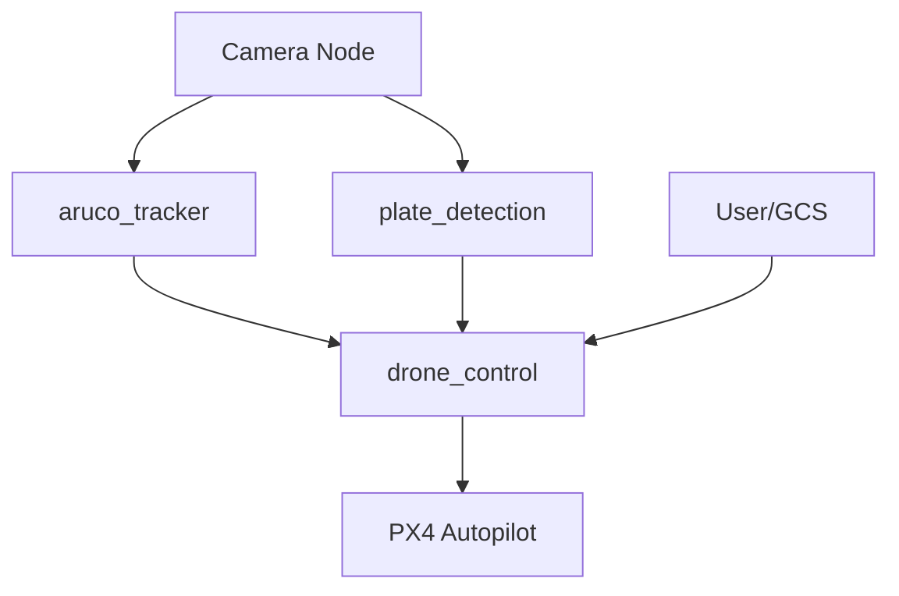
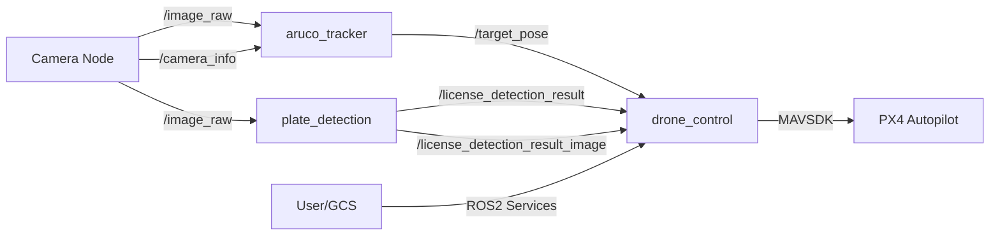
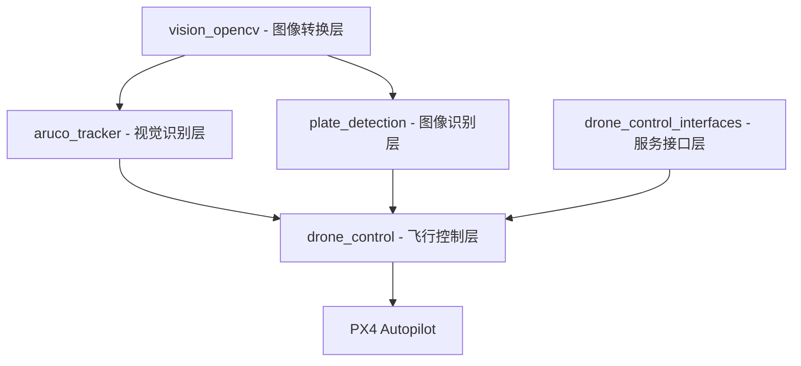
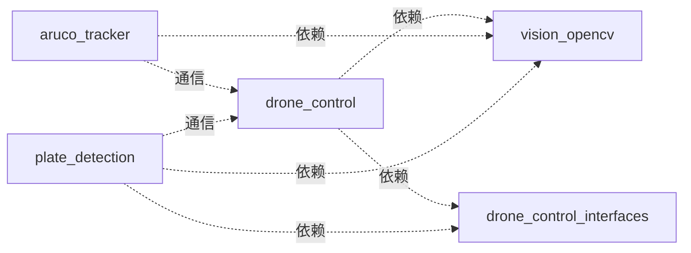
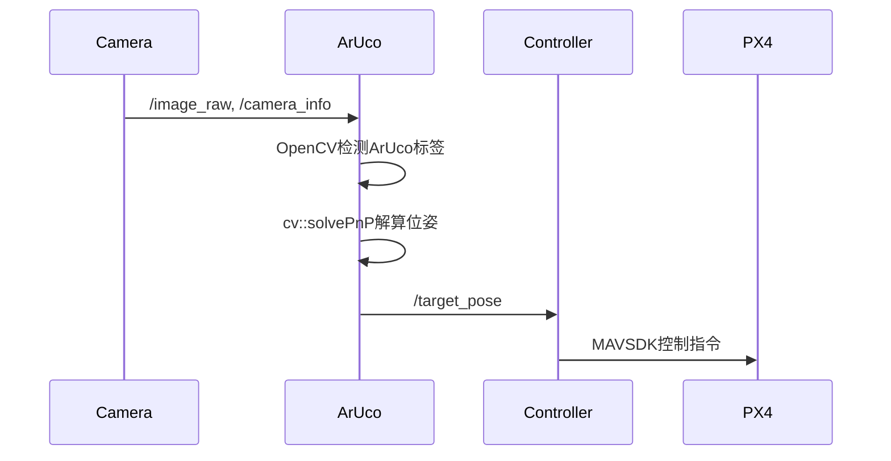
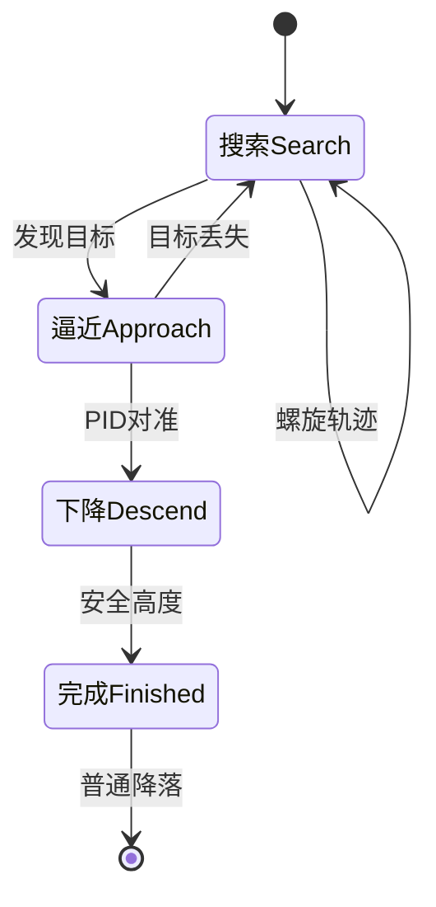
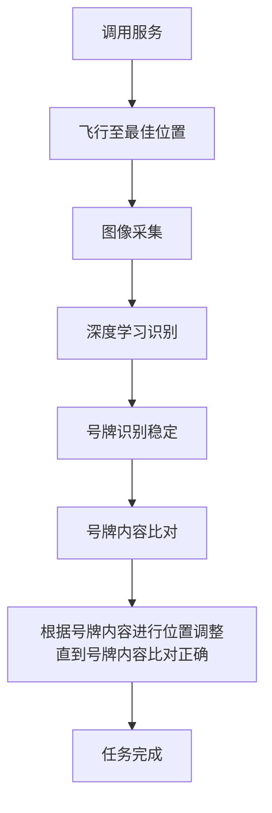
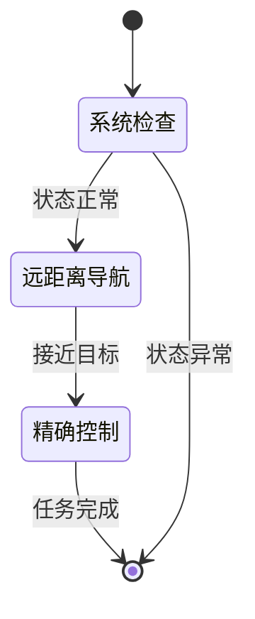
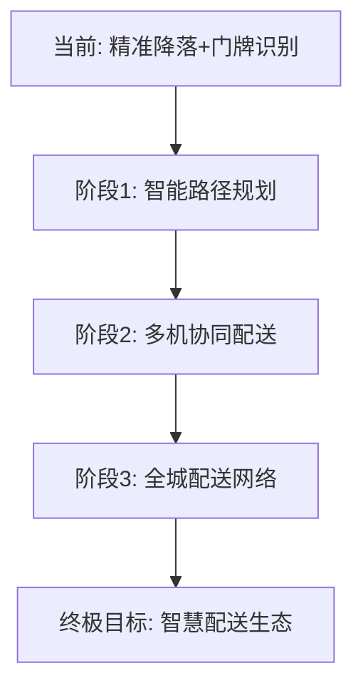

  

# 无人机楼宇配送系统技术文档

  

> 专为智慧城市楼宇配送场景设计的自主视觉导航系统

| 章节 | 内容 |
|------|------|
| [[#1. 引言]] | [[#1.1 项目背景与目标]] • [[#1.2 核心功能概览]] • [[#1.3 技术栈]] |
| [[#2. 系统架构]] | [[#2.1 核心节点与功能包]] • [[#2.2 节点间通信]] • [[#2.3 软件与硬件交互]] • [[#2.4 依赖注入架构设计]] • [[#2.5 模块划分]] |
| [[#3. 接口定义]] | [[#3.1 服务接口]] • [[#3.2 MAVSDK控制接口]] • [[#3.3 无人机状态接口]] |
| [[#4. 数据结构]] | [[#4.1 ArUco标签数据]] • [[#4.2 任务项数据]] |
| [[#5. 核心功能详解]] | [[#5.1 精准降落 (Precision Landing)]] • [[#5.2 门牌识别与确认 (License Plate Recognition)]] • [[#5.3 导航与控制 (Navigation & Control)]] |
| [[#6. 安装与使用]] | [[#6.1 环境要求]] • [[#6.2 构建与安装]] • [[#6.3 系统启动]] • [[#6.4 使用示例]] |
| [[#7. 附录]] | [[#7.1 故障排查 (Troubleshooting)]] • [[#7.2 未来工作]] • [[#7.3 联系与支持 (Contact & Support)]]|

---
  
> 文档信息  

> 版本: v1.0  

> 创建日期: 2025年10月1日  

> 作者: colu

________________________________________

# 1. 引言

## 1.1 项目背景与目标
> 项目愿景: 开发一个基于**ROS2**和**PX4飞控**的无人机自主视觉导航系统，专为**楼宇配送**场景优化

### 市场应用背景
随着电商快速发展和"最后一公里"配送需求激增，传统人力配送面临**成本高、效率低、时间受限**等挑战。特别是在高层楼宇配送中，配送员需要花费大量时间等待电梯、寻找户号，配送效率大打折扣。

### 项目核心目标
本项目利用先进的计算机视觉技术和现代化的机器人操作系统（ROS2），赋予无人机在复杂城市环境中执行**精准楼宇配送**的能力：

- **厘米级精准降落**: 基于ArUco视觉标签，实现阳台、窗户等狭小空间的精准降落

- **智能门牌识别**: 自动识别住户门牌号，确保配送准确无误  

- **成本优化**: 单台无人机可替代3-5名配送员，大幅降低人力成本
  
### 未来愿景
> 足不出户，万物直达 - 让未来的城市生活更加便捷智能
通过本系统的不断完善和普及，用户只需在手机下单，无人机就能将商品直接配送到阳台或指定位置，真正实现**"足不出户取万物"**的智慧生活场景。这不仅将革命性地改变城市配送模式，更将为构建智慧城市、提升生活品质贡献重要力量。

  
## 1.2 核心功能概览

| 功能模块 | 楼宇配送应用 | 技术指标 |
|------------|---------|------------|
| **精准降落** | 阳台/窗户等狭小空间精准降落配送 | 厘米级精度，±5cm误差 |
| **智能门牌识别** | 自动识别住户门牌号，确保配送准确 | 识别准确率>98%，实时处理 |
| **成本优化** | 单台无人机替代3-5名传统配送员 | 配送成本降低70% |
| **模块化设计** | 高度模块化的ROS2功能包设计 | 易扩展维护 |

## 1.3 技术栈

```yaml

# 核心技术组件

操作系统: ROS2 Humble

飞控通信: MAVSDK-Python

计算机视觉: OpenCV

深度学习: PyTorch (门牌识别)

编程语言: Python, C++

# 硬件平台

无人机: 支持PX4固件, 能挂载相机与额外电源

机载计算机: ARM64

视觉传感器: Intel RealSense, USB相机

```
________________________________________

# 2. 系统架构

## 2.1 核心节点与功能包



| 功能包 | 主要功能 | 编程语言 | 关键特性 |
|-----------|------------|-------------|-------------|
| **drone_control** | 核心控制中枢 | Python | 飞行控制、状态监控、任务调度 |
| **aruco_tracker** | 视觉标签检测 | C++ | 高效ArUco码识别、实时位姿发布 |
| **plate_detection** | 门牌识别 | Python | 深度学习模型、透视变换校正 |
| **vision_opencv** | 图像格式转换 | C++ | cv_bridge工具、ROS2-OpenCV桥梁 |

## 2.2 节点间通信

### 通信关系图



### 关键Topics

| 话题名称 | 消息类型 | 发布者 | 描述 |
|------------|------------|----------|---------|
| `/image_raw` | `sensor_msgs/msg/Image` | 相机驱动 | 原始图像流 |
| `/camera_info` | `sensor_msgs/msg/CameraInfo` | 相机驱动 | 相机内参和畸变系数 |
| `/target_pose` | `geometry_msgs/msg/PoseStamped` | aruco_tracker | ArUco标签位姿 |
| `/license_detection_result` | `drone_control_interfaces/msg/LicenseInfo` | plate_detection | 门牌信息（含门牌号和位置） |

### 关键Services

| 服务名称 | 服务类型 | 功能描述 |
|------------|------------|-------------|
| `/drone/navigation` | `drone_control_interfaces/srv/Pos` | NED坐标系相对位置导航 |
| `/drone/hybrid_navigation` | `drone_control_interfaces/srv/Nav` | 混合导航服务，包含位置和偏航角 |
| `/drone/precision_land` | `std_srvs/srv/Trigger` | 触发精准降落状态机 |
| `/drone/confirm_license` | `std_srvs/srv/Trigger` | 触发门牌识别确认任务 |

## 2.3 软件与硬件交互

> 连接策略: 优先串口
drone_control_node通过MAVSDK库与PX4飞控通信：
```bash

# 串口连接 (优先)

/dev/ttyACM0

/dev/ttyACM1

/dev/ttyACM2

```
连接流程：节点启动时自动检测串口设备（可添加自己的设备号）

## 2.4 依赖注入架构设计
> 设计原则: MAVSDK函数和无人机状态采用依赖注入，提高代码可测试性和模块化程度

### 依赖注入实现

```python
# 状态类依赖注入示例
class ControllerBaseState:
    def __init__(self, drone_state: DroneState, mavsdk_system):
        self.drone_state = drone_state  # 状态依赖注入
        self.system = mavsdk_system     # MAVSDK依赖注入
    def get_current_altitude(self):
        """通过注入的drone_state获取高度"""
        return self.drone_state.get_current_altitude()
    async def set_velocity_ned(self, vx, vy, vz, yaw_rate):
        """通过注入的mavsdk_system发送速度指令"""
        await self.system.offboard.set_velocity_ned(
            VelocityNedYaw(vx, vy, vz, yaw_rate)
        )
        
# 控制器基类
class ControllerBase(abc.ABC):
    """
    任务控制器的抽象基类。
    定义了拥有状态机的独立行为单元。
    """
    def __init__(self, node):
        self.node = node
        self.state_machine = StateMachine()
        self.drone_state = node.drone_state
        self.mavsdk_controller = node.mavsdk_controller
        self.logger = node.get_logger()
        self._register_states()

```

### 依赖注入优势
| 优势类别 | 具体表现 | 楼宇配送场景价值 |
|------------|------------|------------------|
| **可测试性** | 轻松mock MAVSDK和传感器数据 | 仿真测试无需真实硬件 |
| **模块化** | 各组件松耦合，独立开发维护 | 多人协作开发更高效 |
| **可配置性** | 运行时切换不同实现 | 支持仿真/硬件无缝切换 |
| **代码复用** | 通用组件可跨项目使用 | 降低开发成本 |


________________________________________

## 2.5 模块划分


### 系统层次架构



### 核心模块职责

#### 2.5.1 drone_control - 无人机飞行控制层

**核心地位**: 作为系统的中央控制枢纽，负责协调所有其他模块

  

| 子模块 | 功能职责 | 关键技术 |
|---------|------------|-------------|
| **核心控制** | 飞行状态管理、MAVSDK通信 | 依赖注入、异步编程 |
| **精准降落** | ArUco标记跟踪、视觉导航 | 状态机、PID控制 |
| **门牌确认** | 门牌识别流程控制 | 状态管理、数据库交互 |
| **导航服务** | 相对/绝对位置导航 | NED坐标系、混合导航 |
| **状态监控** | 实时状态监测与报告 | 多线程、数据同步 |

  

#### 2.5.2 aruco_tracker - ArUco标记识别层

**功能定位**: 专门负责ArUco标记的视觉检测与位姿解算

  

- **输入**: 相机原始图像流 (`/image_raw`)

- **处理**: OpenCV ArUco检测 + solvePnP位姿解算

- **输出**: 标记位姿信息 (`/target_pose`)

- **特性**: C++实现，30Hz实时处理，支持多标记同时检测

  

#### 2.5.3 plate_detection - 门牌识别层

**功能定位**: 基于深度学习的门牌号码识别

- **输入**: 相机图像 (`/image_raw`)
- **处理**: YOLO检测 + 透视变换 + OCR识别
- **输出**: 识别结果 (`/license_detection_result`)，可视化结果 (`/license_detection_result_image`)
- **特性**: PyTorch框架，支持门牌号和颜色识别，发布结构化的`LicenseInfo`消息

  

#### 2.5.4 vision_opencv - 图像转换层

**功能定位**: ROS2与OpenCV之间的图像格式转换桥梁

  

- **核心组件**: cv_bridge、image_geometry

- **功能**: 图像编码转换、相机模型处理、几何计算

- **特性**: 标准ROS2包，支持多种图像格式

  

#### 2.5.5 drone_control_interfaces - 服务接口层

**功能定位**: 定义系统统一的ROS2服务接口

  

- **服务类型**: 位置导航(Pos)、混合导航(Nav)

- **设计目标**: 标准化控制接口，支持未来动作扩展

- **特性**: 简洁的请求/响应格式，易于集成

  

### 模块间依赖关系

  



  

**关键设计原则**:

- **单向依赖**: 视觉识别层依赖转换层，控制层依赖所有底层

- **松耦合通信**: 基于ROS2话题/服务的异步通信

- **接口标准化**: 统一的服务接口定义，便于扩展和维护

________________________________________

# 3. 接口定义
  

## 3.1 服务接口

### drone_control_interfaces 服务定义

系统采用标准化的ROS2服务接口，定义在`drone_control_interfaces`包中，为上层应用提供统一的控制接口。

#### 3.1.1 Pos服务 - 相对位置导航

**服务文件**: `drone_control_interfaces/srv/Pos.srv`

```yaml
# 请求字段
float64 x    # X轴相对位移 (NED坐标系，单位：米)
float64 y    # Y轴相对位移 (NED坐标系，单位：米)  
float64 z    # Z轴相对位移 (NED坐标系，单位：米，负值表示上升)
float64 w    # 偏航角 (单位：度)
---
# 响应字段
bool success    # 操作成功标志
string message  # 状态描述信息
```
  
**应用场景**:

- 精准降落过程中的微调

- 门牌识别时的位置调整

- 相对目标点的精确导航

#### 3.1.2 Nav服务 - 混合导航

**服务文件**: `drone_control_interfaces/srv/Nav.srv`

```yaml
# 请求字段
float64 latitude_deg        # 目标纬度 (单位：度，WGS84坐标系)
float64 longitude_deg       # 目标经度 (单位：度，WGS84坐标系)
float64 absolute_altitude_m  # 绝对海拔高度 (单位：米)
float64 yaw_deg             # 目标偏航角 (单位：度)
---
# 响应字段
bool success    # 操作成功标志
string message  # 状态描述信息
```

**应用场景**:

- GPS坐标导航

- 楼宇间长距离飞行

- 配送目标点导航

  

## 3.2 MAVSDK控制接口

  

### 3.2.1 MavsdkController 类接口

  

**文件位置**: `drone_control/core/mavsdk_control.py`

  

该类封装了MAVSDK-Python的核心功能，提供高层次的无人机控制接口：

  

#### 基础控制接口

  

| 方法 | 功能 | 参数 | 返回值 |
|------|------|------|--------|
| `_connect_to_drone()` | 连接无人机 | `system_address: str` | `None` |
| `arm()` | 解锁电机 | 无 | `bool` |
| `disarm()` | 锁定电机 | 无 | `bool` |
| `takeoff(altitude)` | 起飞到指定高度 | `altitude: float` | `bool` |
| `land()` | 执行降落 | 无 | `bool` |
| `hold()` | 悬停 | 无 | `bool` |

  

#### 高级导航接口

  

| 方法 | 功能 | 参数 | 特性 |
|------|------|------|------|
| `start_offboard()` | 启动板外模式 | 无 | 精确控制前提 |
| `stop_offboard()` | 停止板外模式 | 无 | 安全退出机制 |
| `goto_position_ned()` | NED坐标导航 | `north, east, down, yaw` | 闭环反馈控制 |
| `set_velocity_ned()` | 速度控制 | `vx, vy, vz, yaw_rate` | 平滑运动控制 |

  

**设计特点**:

- **异步编程**: 所有方法采用async/await模式

- **异常处理**: 完善的错误捕获和日志记录

- **状态反馈**: 实时位置监控和到达检测

- **安全机制**: 超时保护、边界检查

  

## 3.3 无人机状态接口

  

### 3.3.1 DroneState 状态管理类

  

**文件位置**: `drone_control/core/drone_state.py`

  

提供统一的无人机状态访问接口，实现状态数据的集中管理：

  

#### 核心状态属性

  

```python
class DroneState:
    # 连接与基础状态
    connected: bool              # MAVSDK连接状态
    is_armed: bool               # 电机解锁状态  
    landed: bool                 # 降落状态
    current_flight_mode: str     # 当前飞行模式
    # 位置信息
    current_position: GPS坐标   # 当前GPS位置
    current_position_ned: NED坐标 # NED坐标系位置
    home_position_ned: NED坐标   # 解锁点位置
    target_position: np.ndarray  # 目标位置数组
    # 姿态信息
    attitude_quaternion: 四元数  # 四元数姿态
    attitude_euler: 欧拉角      # 欧拉角姿态
    # 任务状态
    search_started: bool         # 精准降落搜索状态
    confirm_started: bool          # 门牌确认状态
```

#### 关键方法接口


| 方法 | 功能 | 返回值 |
|------|------|--------|
| `update_connection()` | 更新连接状态 | `None` |
| `update_position()` | 更新位置信息 | `None` |
| `get_current_altitude()` | 获取当前高度 | `float/None` |
| `is_ready_for_flight()` | 检查飞行准备状态 | `bool` |
| `get_status_summary()` | 获取状态摘要 | `dict` |

  

**设计优势**:

- **集中管理**: 所有状态数据统一存储和管理

- **线程安全**: 支持多线程环境下的安全访问

- **实时更新**: 与MAVSDK保持同步更新

- **状态验证**: 提供数据有效性检查机制

  

________________________________________

# 4. 数据结构

  

## 4.1 ArUco标签数据

  

### 4.1.1 ArucoTag 类定义

  

**文件位置**: `drone_control/utils/ArucoTag.py`

  

该类封装了ArUco标记的核心数据，为视觉导航提供标准化的数据结构：

  

```python
class ArucoTag:
    def __init__(self, position: np.ndarray=None, orientation: Optional[R]=None, timestamp=0):
        self.position = position        # 3D位置向量 (x, y, z)
        self.orientation = orientation # 旋转四元数或旋转矩阵
        self.timestamp = timestamp     # 检测时间戳
    def is_valid(self) -> bool:
        """检查标记数据是否有效"""
        return (self.timestamp > 0 and
                self.position is not None and
                self.orientation is not None)
```


#### 数据特性


| 属性 | 数据类型 | 物理意义 | 坐标系 |
|------|----------|----------|--------|
| `position` | `np.ndarray (3,)` | 标记中心位置 | 相机坐标系 |
| `orientation` | `scipy Rotation` | 标记姿态旋转 | 四元数表示 |
| `timestamp` | `float` | 检测时间戳 | 系统时间 |


#### 应用场景
  

- **精准降落**: 提供降落目标的位置和姿态参考

- **视觉导航**: 作为视觉路标进行相对定位

- **姿态估计**: 辅助无人机的姿态精化

  

## 4.2 任务项数据

  

### 4.2.1 SimpleMissionItem 类定义

  

**文件位置**: `drone_control/utils/SimpleMissionItem.py`

  

简化任务项类，用于表示基本的导航任务点，避免完整MissionItem的复杂性：

  

```python
class SimpleMissionItem:
    def __init__(self, latitude, longitude, altitude, speed):
        # 输入验证
        if not (-90 <= latitude <= 90):
            raise ValueError("纬度必须在-90到90度之间")
        if not (-180 <= longitude <= 180):
            raise ValueError("经度必须在-180到180度之间")
        if not (0 <= altitude <= 1000):
            raise ValueError("高度必须在0到1000米之间")
        if not (0 <= speed <= 20):
            raise ValueError("速度必须在0到20米/秒之间")
        self.latitude = latitude   # 目标纬度 (度)
        self.longitude = longitude # 目标经度 (度)
        self.altitude = altitude  # 目标海拔高度 (米)
        self.speed = speed       # 飞行速度 (米/秒)
```

  

#### 设计优势

  

| 特性 | 说明 | 楼宇配送价值 |
|------|------|--------------|
| **简化接口** | 仅需4个核心参数 | 降低使用复杂度 |
| **输入验证** | 严格的参数范围检查 | 提高数据可靠性 |
| **轻量级** | 最小化的内存占用 | 适合高频任务更新 |
| **标准化** | 统一的任务表示格式 | 便于任务管理和调度 |

  

#### 使用场景

  

- **航点导航**: 定义配送路径的关键点

- **区域巡逻**: 设置监控区域的边界点

- **紧急返航**: 指定安全的返航目标点

  

### 4.2.2 与完整MissionItem的对比

  

| 特性 | SimpleMissionItem | 完整MissionItem | 选择理由 |
|------|-------------------|------------------|----------|
| **参数数量** | 4个 | 14+个 | 简化操作 |
| **验证机制** | 内置验证 | 需外部验证 | 数据安全 |
| **内存占用** | 最小化 | 较大 | 性能优化 |
| **适用场景** | 简单导航 | 复杂任务 | 匹配需求 |

  

**结论**: 在楼宇配送场景中，SimpleMissionItem提供了足够的功能，同时大幅简化了开发复杂度。

  
  

________________________________________

# 5. 核心功能详解

  

## 5.1 精准降落 (Precision Landing)

  

### 实现原理

  



  

### 控制流程 (状态机)

  



  

| 状态 | 描述 | 控制策略 |
|---------|---------|-------------|
| **搜索** | 目标丢失时 | 螺旋搜索轨迹 |
| **逼近** | 识别目标后 | PID控制器对准 |
| **下降** | 对准完成后 | XY锁定垂直下降 |
| **完成** | 安全高度 | 切换普通降落 |

  

## 5.2 门牌识别与确认 (License Plate Recognition)

### 号牌设计演变

当前系统中使用的号牌设计遵循全国唯一性原则，确保每个门牌在全国范围内具有唯一标识。然而，未来的设计方向将转向区域性唯一性（例如厦门市内唯一），这种设计有以下优势：

- 号牌字符数量减少，使识别更加精确和可靠

- 简化的号牌更容易被人眼识别和记忆

- 在特定区域内仍然保持足够的唯一性

- 降低了OCR模型的识别难度，提高识别准确率


### 实现原理

  

```python
# 核心处理流程
class PlateRecognition:
    def __init__(self):
        self.model = load_pretrained_model()
        self.transform = PerspectiveTransform()
    def process_frame(self, image):
        # 1. 深度学习检测
        detections = self.model.detect(image)
        # 2. 透视变换校正
        corrected = self.transform.correct(detections)
        # 3. 字符识别
        plate_text = self.model.recognize(corrected)
        return plate_text
```

  

### 工作流程

  



  

## 5.3 导航与控制 (Navigation & Control)

  

### 板外模式 (Offboard Mode)

  

> 定义: 机载计算机高频发送设定点给PX4飞控，实现精确轨迹控制

  

### 混合导航流程

  



  

### 导航阶段对比

  

| 阶段 | 模式 | 精度 | 距离 | 特点 |
|---------|---------|---------|---------|---------|
| **系统检查** | 自检模式 | - | - | 确保安全起飞 |
| **远距离导航** | 任务模式 | 米级 | >10m | GPS导航高效 |
| **精确控制** | 板外模式 | 厘米级 | <10m | 精确位置控制 |

  

### 坐标系统

  

> NED坐标系 (North-East-Down)

  

```plaintext

坐标示例: (1.0, 2.0, -3.0)

• 北向: +1.0米

• 东向: +2.0米

• 上方: +3.0米 (Z轴向下为正)

```

  

________________________________________

# 6. 安装与使用

  

## 6.1 环境要求

  

| 组件             | 版本要求 | 安装命令                         |
| ----------------- | ------- | ------------------------------- |
| **ROS2**          | Humble+ | [官方安装指南](https://docs.ros.org/) |
| **Python**        | 3.8+    | `sudo apt install python3.8`    |
| **MAVSDK-Python** | 最新版     | `pip install mavsdk`            |
| **PX4仿真**         | v1.16  | [PX4源码编译](https://px4.io/)      |

  

## 6.2 构建与安装

  

### 步骤1: 安装依赖

  

```bash
# 回到主目录
cd

# 下载源码
git clone https://github.com/uuioop/drone_with_mavsdk.git

# 进入文件夹
cd drone_with_mavsdk/services/

# 源码编译特定的opencv版本 
chmod +x install_opencv.sh
./install_opencv.sh

# 创建虚拟环境，只隔离python包（可选并推荐）
cd ..
python3 -m venv venv_ros
  
# 安装相关python包
pip3 install -r services/requirements.txt
```

  

### 步骤2: 构建功能包

  

```bash
# 激活ROS2环境(可写入~/.bashrc文件中)
source /opt/ros/humble/setup.bash

# 进入工作目录
cd ~/drone_with_mavsdk

# 选择性构建
colcon build --packages-select drone_control aruco_tracker plate_detection

# 或完整构建
colcon build

# 激活工作环境(可写入~/.bashrc文件中，需完整路径)
source install/setup.bash

# ROS2的命令都需先激活ROS2环境，如针对某一自定义功能包需再激活对应工作环境
```
  

## 6.3 系统启动


### 仿真环境启动

  

```bash
# 无论仿真环境还是真实环境相机节点启动都包含在aruco_tracker包的启动文件中
# 在这之前先将环境仓库克隆到本地并替换PX4默认环境和模型
git clone https://github.com/uuioop/px4_gz.git

# 启动PX4 SITL + Gazebo仿真
make px4_sitl gz_x500_depth

# 每开一个新终端需重新激活工作环境
# 1. 启动视觉节点 (新终端)
source ~/drone_with_mavsdk/install/setup.bash
ros2 launch aruco_tracker gazebo_aruco_tracker.launch.py

# 2. 启动飞行控制节点(新终端)
source ~/drone_with_mavsdk/install/setup.bash
ros2 run drone_control drone_control_node

# 3. 启动门牌检测节点(新终端)
source ~/drone_with_mavsdk/install/setup.bash
ros2 launch plate_detection plate_detection.launch.py
```

  

> 仿真配置: 使用Gazebo Sim 8.9.0 + Ubuntu 22.04(LTS) + 下视单目相机 + 前视红外深度相机 + 自定义楼宇环境

> 环境仓库: [https://github.com/uuioop/px4_gz](https://github.com/uuioop/px4_gz)


### 真实环境启动


```bash
# 启动核心控制节点
ros2 run drone_control drone_control_node

# 启动视觉节点 (新终端)
ros2 launch aruco_tracker real_aruco_tracker.launch.py 

# 启动门牌识别节点 (新终端)
ros2 launch plate_detection  plate_detection.launch.py
```

  

> 启动内容:

> - drone_control_node (核心控制)

> - usb_cam_node_exe (USB相机) realsense2_camera_node (RealSense相机) aruco_tracker_node (视觉跟踪)

> - plate_detection_node (门牌识别)

  

## 6.4 使用示例


### 导航控制命令


```bash
# 相对位置导航 (向北1米，上升2米)
ros2 service call /drone/navigation drone_control_interfaces/srv/Pos \
  "{x: 1.0, y: 0.0, z: -2.0, w: 0.0}"

# 绝对位置导航 （GPS坐标）
ros2 service call /drone/navigation drone_control_interfaces/srv/Nav \
  "{latitude_deg: 47.398160, longitude_deg: 8.545593, absolute_altitude_m: 42.0, yaw_deg: 0.0}"

# 视觉精准降落
ros2 service call /drone/precision_land std_srvs/srv/Trigger

# 门牌识别确认
ros2 service call /drone/confirm_license std_srvs/srv/Trigger
```
  

### 监控与调试
  

```bash
# 查看节点状态
ros2 node list

# 检查话题通信
ros2 topic list
ros2 topic echo /target_pose

# 服务验证
ros2 service list
ros2 service call /drone/get_status std_srvs/srv/Trigger
```

________________________________________

# 7. 附录

  

## 7.1 故障排查 (Troubleshooting)

  

### 连接问题

  

| 错误信息 | 可能原因 | 解决方案 |
|------------|-------------|-------------|
| **未连接无人机** | 物理连接异常 | 检查USB线缆、端口权限 |
| **连接超时** | 飞控未就绪 | 确认PX4已启动、端口正确 |
| **权限拒绝** | 用户权限不足 | `sudo usermod -a -G dialout $USER` |

  

### 视觉问题排查

  

```bash

# 检查相机话题
ros2 topic list | grep image

# 验证相机驱动
ros2 node list | grep camera

# 查看图像质量
ros2 topic echo /camera/image_raw --no-arr

# 测试图像显示
ros2 run rqt_image_view rqt_image_view
```

  

> 常见解决: 相机问题通常与驱动安装、权限设置或话题名称配置有关

  

## 7.2 未来工作

  

### 楼宇配送商业化方向

  

#### 市场机遇分析

  

| 应用场景 | 市场规模 | 成本效益 | 效率提升 |
|------------|------------|------------|------------|
| **高层住宅配送** | 千亿级市场 | 节省70%人力成本 | 5倍配送效率 |
| **商务楼宇快递** | 快速增长 | 替代3-5名配送员 | 24小时服务 |

  

#### 技术演进路线

  



  

### 商业模式创新

  

#### B2B企业合作

- **物业公司**: 提供楼宇配送解决方案

- **电商平台**: 战略合作最后一公里配送

- **快递公司**: 技术授权和服务外包

  

#### B2C直接服务

- **高端社区**: 会员制配送服务

- **紧急配送**: 按需付费加急服务

- **订阅模式**: 月度/年度配送套餐

  

> 终极目标: 打造"无人机+楼宇配送"的完整生态系统，让配送服务像水电一样成为城市基础设施的重要组成部分，真正实现"足不出户，万物直达"的智慧生活愿景。


## 7.3 联系与支持 (Contact & Support)

我们欢迎任何形式的反馈、问题和贡献。您可以通过以下渠道联系我们：

- **项目主页 & 源码**:
  - https://github.com/uuioop/drone_with_mavsdk

- **问题与Bug报告**:
  - 如果您在使用中遇到任何问题或发现Bug，请通过 GitHub Issues 提交给我们：
  - https://github.com/uuioop/drone_with_mavsdk/issues

- **技术交流与讨论**:
  - 我们推荐您使用 GitHub Discussions 功能进行开放式技术交流。


---


  

## 紧急处理

### 暂时用遥控器进行接管
  

---
  

<div align="center">

  

> 文档版本: v1.0  |  更新日期: 2025年10月1日  |  最后修改: 2025年10月1日

  

提示: 本文档持续更新中，如有问题请提交Issue或联系维护团队

  

</div>